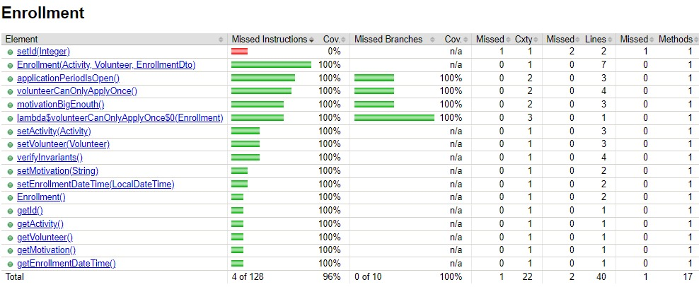
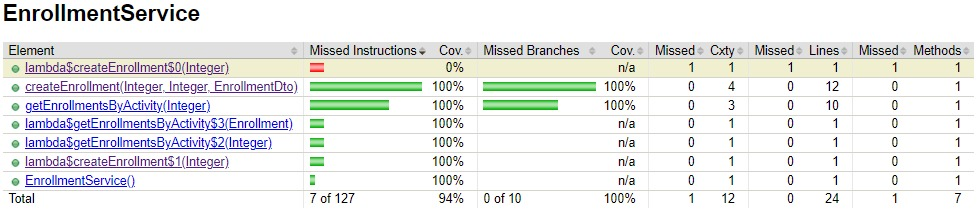
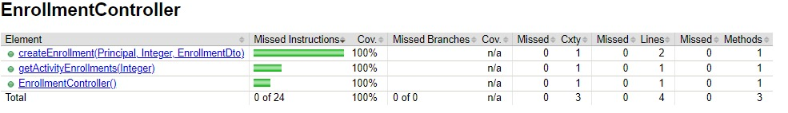
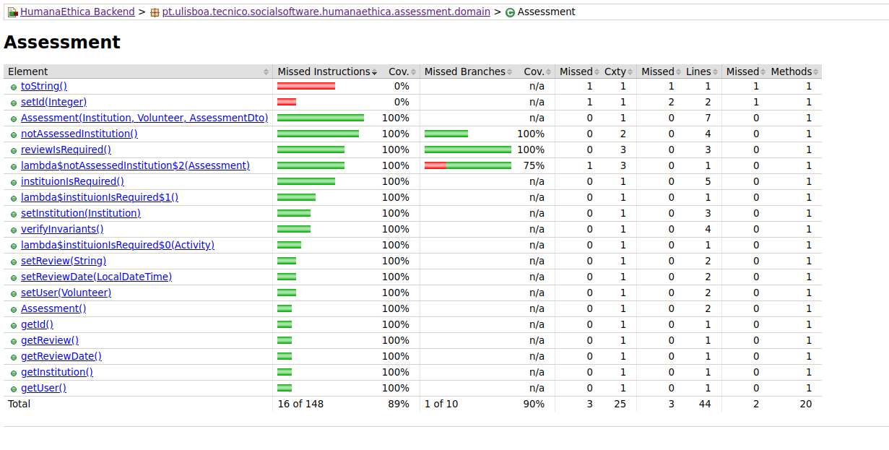
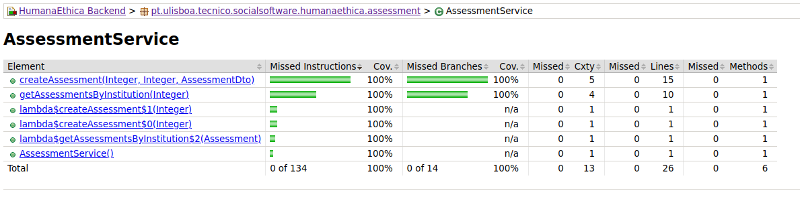
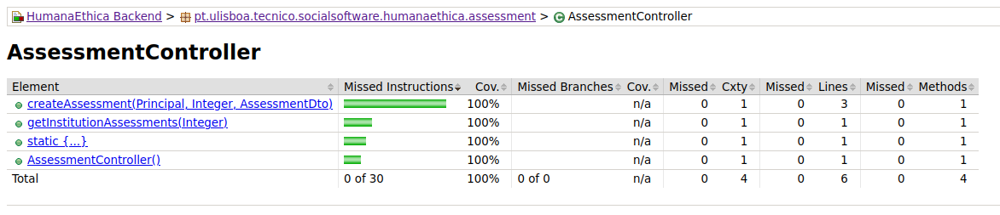

# ES P1 submission, Group 60

## Não conseguimos fazer o rebase do select-participant para o master, a select-participant tem de ser avaliada à parte e encontra-se em:
[Select Participant Branch](https://gitlab.rnl.tecnico.ulisboa.pt/es/es24-60/-/tree/select-participant)

## Feature Activity Enrollment

### Subgroup
 - Alexandre, ist1102948, [GitLab link](https://gitlab.rnl.tecnico.ulisboa.pt/ist1102948)
   + Issues assigned: [#18](https://gitlab.rnl.tecnico.ulisboa.pt/es/es24-60/-/issues/18), [#4](https://gitlab.rnl.tecnico.ulisboa.pt/es/es24-60/-/issues/4), [#23](https://gitlab.rnl.tecnico.ulisboa.pt/es/es24-60/-/issues/23), [#12](https://gitlab.rnl.tecnico.ulisboa.pt/es/es24-60/-/issues/12), [#14](https://gitlab.rnl.tecnico.ulisboa.pt/es/es24-60/-/issues/14)
 - Joana Marques, ist1103131, [GitLab link](https://gitlab.rnl.tecnico.ulisboa.pt/ist1103131)
   + Issues assigned: [#19](https://gitlab.rnl.tecnico.ulisboa.pt/es/es24-60/-/issues/19), [#5](https://gitlab.rnl.tecnico.ulisboa.pt/es/es24-60/-/issues/5), [#20](https://gitlab.rnl.tecnico.ulisboa.pt/es/es24-60/-/issues/20), [#11](https://gitlab.rnl.tecnico.ulisboa.pt/es/es24-60/-/issues/11), [#13](https://gitlab.rnl.tecnico.ulisboa.pt/es/es24-60/-/issues/13), [#15](https://gitlab.rnl.tecnico.ulisboa.pt/es/es24-60/-/issues/15)
 
### Merge requests associated with this feature

The list of pull requests associated with this feature is:

 - [MR #1](https://gitlab.rnl.tecnico.ulisboa.pt/es/es24-60/-/merge_requests/2)

### Test Coverage Screenshot

The screenshot includes the test coverage results associated with the new/changed entities:

#### Enrollment test coverage

#### Enrollment Service test coverage

#### Enrollment Controller test coverage

---

## Feature Participant Selection

### Subgroup
 - Bernardo Meireles, ist1103378, [GitLab link](https://gitlab.rnl.tecnico.ulisboa.pt/ist1103378)
   + Issues assigned: [#40](https://gitlab.rnl.tecnico.ulisboa.pt/es/es24-60/-/issues/40), [#42](https://gitlab.rnl.tecnico.ulisboa.pt/es/es24-60/-/issues/42), [#43](https://gitlab.rnl.tecnico.ulisboa.pt/es/es24-60/-/issues/43), [#44](https://gitlab.rnl.tecnico.ulisboa.pt/es/es24-60/-/issues/44), [#46](https://gitlab.rnl.tecnico.ulisboa.pt/es/es24-60/-/issues/46), [#48](https://gitlab.rnl.tecnico.ulisboa.pt/es/es24-60/-/issues/48)
 - João Nogueira, ist1103808, [GitLab link](https://gitlab.rnl.tecnico.ulisboa.pt/ist1103808)
   + Issues assigned: [#38](https://gitlab.rnl.tecnico.ulisboa.pt/es/es24-60/-/issues/38), [#39](https://gitlab.rnl.tecnico.ulisboa.pt/es/es24-60/-/issues/39), [#45](https://gitlab.rnl.tecnico.ulisboa.pt/es/es24-60/-/issues/45), [#47](https://gitlab.rnl.tecnico.ulisboa.pt/es/es24-60/-/issues/47)
 
### Merge requests associated with this feature

The list of pull requests associated with this feature is:

 - [MR #1](https://gitlab.rnl.tecnico.ulisboa.pt/es)
 - [MR #2](https://gitlab.rnl.tecnico.ulisboa.pt/es)
 - [MR #3](https://gitlab.rnl.tecnico.ulisboa.pt/es)

### Test Coverage Screenshot

The screenshot includes the test coverage results associated with the new/changed entities:

---

## Feature Institution Assessment

### Subgroup
 - André Santos, ist1103597, [GitLab link](https://gitlab.rnl.tecnico.ulisboa.pt/ist1103597)
   + Issues assigned: [#28](https://gitlab.rnl.tecnico.ulisboa.pt/es/es24-60/-/issues/28), [#29](https://gitlab.rnl.tecnico.ulisboa.pt/es/es24-60/-/issues/29), [#32](https://gitlab.rnl.tecnico.ulisboa.pt/es/es24-60/-/issues/32), [#34](https://gitlab.rnl.tecnico.ulisboa.pt/es/es24-60/-/issues/34)
 - João Melo, ist1103808, [GitLab link](https://gitlab.rnl.tecnico.ulisboa.pt/ist1103808)
   + Issues assigned: [#25](https://gitlab.rnl.tecnico.ulisboa.pt/es/es24-60/-/issues/25), [#26](https://gitlab.rnl.tecnico.ulisboa.pt/es/es24-60/-/issues/26), [#27](https://gitlab.rnl.tecnico.ulisboa.pt/es/es24-60/-/issues/27), [#30](https://gitlab.rnl.tecnico.ulisboa.pt/es/es24-60/-/issues/30), [#31](https://gitlab.rnl.tecnico.ulisboa.pt/es/es24-60/-/issues/31), [#33](https://gitlab.rnl.tecnico.ulisboa.pt/es/es24-60/-/issues/33)
 
### Merge requests associated with this feature

The list of pull requests associated with this feature is:

 - [MR #5](https://gitlab.rnl.tecnico.ulisboa.pt/es/es24-60/-/merge_requests/5)

### Test Coverage Screenshot

The screenshot includes the test coverage results associated with the new/changed entities:

#### Assessment test coverage

#### Assessment Service test coverage

#### Assessment Controller test coverage

---
